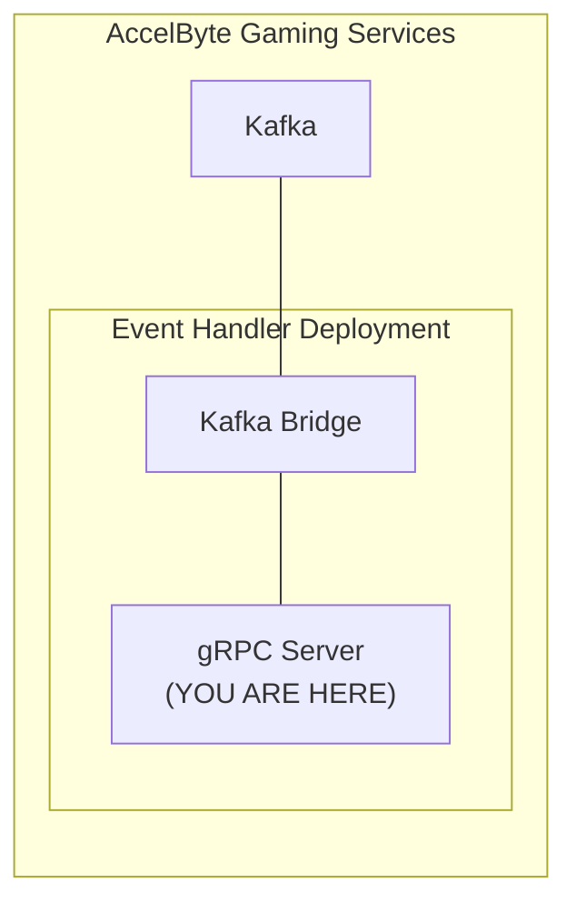

# extend-event-handler-csharp



`AccelByte Gaming Services` events can be extended by using custom functions implemented in a `gRPC server`. 
If configured, custom functions in the `gRPC server` will be called by `Kafka Bridge` to run specific sequence 
specifically required by a game.

The `Kafka Bridge` and the `gRPC server` can actually communicate directly. 
However, additional services are necessary to provide **security**, **reliability**, **scalability**, and **observability**. 
We call these services as `dependency services`. 
The [grpc-plugin-dependencies](https://github.com/AccelByte/grpc-plugin-dependencies) repository is provided 
as an example of what these `dependency services` may look like. It contains a docker compose which consists of 
these `dependency services`.

> :warning: **grpc-plugin-dependencies is provided as example for local development purpose only:** 
> The dependency services in the actual gRPC server deployment may not be exactly the same.

## Overview

This repository contains a `sample event handler app` written in `C#`. 
It provides a simple custom app that will listen to `userLoggedIn` event, and then tried to grant an entitlement to 
the said user. Preconfigured store and `IAM Client ID` is needed to run this app.

This sample app also shows how this `gRPC server` can be instrumented for better observability.
It is configured by default to send metrics, traces, and logs to the observability `dependency services` 
in [grpc-plugin-dependencies](https://github.com/AccelByte/grpc-plugin-dependencies).


## Prerequisites

1. Windows 10 WSL2 or Linux Ubuntu 20.04 with the following tools installed.

   a. bash

   b. make

   c. docker v23.x

   d. docker-compose v2

   e. .net 6 sdk

   f. docker loki driver
    
      ```
      docker plugin install grafana/loki-docker-driver:latest --alias loki --grant-all-permissions
      ```
   g. [ngrok](https://ngrok.com/)

   h. [postman](https://www.postman.com/)

   i. [grpcurl](https://github.com/fullstorydev/grpcurl)

2. A local copy of [grpc-plugin-dependencies](https://github.com/AccelByte/grpc-plugin-dependencies) repository.

   ```
   git clone https://github.com/AccelByte/grpc-plugin-dependencies.git
   ```

3. Access to `AccelByte Gaming Services` demo environment.

   a. Base URL: https://demo.accelbyte.io.
   
   b. [Create a Game Namespace](https://docs.accelbyte.io/esg/uam/namespaces.html#tutorials) 
      if you don't have one yet. Keep the `Namespace ID`.
   
   c. [Create an OAuth Client](https://docs.accelbyte.io/guides/access/iam-client.html with `confidential` client type. Keep the `Client ID` and `Client Secret`.
      ```
      ADMIN:NAMESPACE:*:USER:*:ENTITLEMENT [CREATE]
      ```

4. [Extend Helper CLI](https://github.com/AccelByte/extend-helper-cli) to upload the app to AGS. Note that to use the tool you'll need an AGS account, be sure to follow the docs on the github link above.

5. Published AGS Store. Note the item id, as this app will grant that item as an entitlement after a user in a certain namespace successfully logged in.

## Setup

To be able to run this sample app, you will need to follow these setup steps.

1. Create a docker compose `.env` file by copying the content of [.env.template](.env.template) file.

   > :warning: **The host OS environment variables have higher precedence compared to `.env` file variables**: If the variables in `.env` file do not seem to take effect properly, check if there are host OS environment variables with the same name. 
   See documentation about [docker compose environment variables precedence](https://docs.docker.com/compose/environment-variables/envvars-precedence/) for more details.

2. Fill in the required environment variables in `.env` file as shown below.

   ```
   AB_BASE_URL=https://demo.accelbyte.io     # Base URL of AccelByte Gaming Services demo environment
   AB_CLIENT_ID='xxxxxxxxxx'                 # Client ID from the Prerequisites section
   AB_CLIENT_SECRET='xxxxxxxxxx'             # Client Secret from the Prerequisites section
   AB_NAMESPACE='xxxxxxxxxx'                 # Namespace ID from the Prerequisites section
   PLUGIN_GRPC_SERVER_AUTH_ENABLED=false     # Enable or disable access token and permission verification
   ITEM_ID_TO_GRANT='xxxxxxxxxx'             # Item id from a published store we noted previously
   ```

   > :warning: **Keep PLUGIN_GRPC_SERVER_AUTH_ENABLED=false for now**: It is currently not
   supported by `AccelByte Gaming Services`, but it will be enabled later on to improve security. If it is
   enabled, the gRPC server will reject any calls from gRPC clients without proper authorization
   metadata.

For more options, create `src/AccelByte.PluginArch.EventHandler.Demo.Server/appsettings.Development.json` and fill in the required configuration.

```json
{
  "DirectLogToLoki": false,
  "EnableAuthorization": false,                 // Enable or disable access token and permission check (env var: PLUGIN_GRPC_SERVER_AUTH_ENABLED)
  "RevocationListRefreshPeriod": 60,
  "AccelByte": {
    "BaseUrl": "https://demo.accelbyte.io",     // Base URL (env var: AB_BASE_URL)
    "ClientId": "xxxxxxxxxx",                   // Client ID (env var: AB_CLIENT_ID)    
    "ClientSecret": "xxxxxxxxxx",               // Client Secret (env var: AB_CLIENT_SECRET)
    "AppName": "EVENTHANDLERDEMOGRPCSERVICE",
    "TraceIdVersion": "1",
    "Namespace": "xxxxxxxxxx",                  // Namespace ID (env var: AB_NAMESPACE)
    "EnableTraceId": true,
    "EnableUserAgentInfo": true,
    "ResourceName": "EVENTHANDLERDEMOGRPCSERVICE",
    "ItemIdToGrant": "xxxxxxxxxxxx"             // ItemId to grant (env var: ITEM_ID_TO_GRANT)
  }
}
```
> :warning: **Environment variable values will override related configuration values in this file**.


## Building

To build this sample app, use the following command.

```shell
$ make build
```

## Running

To (build and) run this sample app in a container, use the following command.

```shell
$ docker-compose up --build
```

## Testing

### Unit Test

Unit test is provided to test the functionaly without actually invoking the grpc function. Unit test is provided in `src/AccelByte.PluginArch.EventHandler.Demo.Tests`. To run the test, you'll need to fill the env var file mentioned below,
```
AB_BASE_URL=https://demo.accelbyte.io     # Base URL of AccelByte Gaming Services demo environment
AB_CLIENT_ID='xxxxxxxxxx'                 # Client ID from the Prerequisites section
AB_CLIENT_SECRET='xxxxxxxxxx'             # Client Secret from the Prerequisites section
AB_NAMESPACE='xxxxxxxxxx'                 # Namespace ID from the Prerequisites section
```
then run this command.

```shell
$ make test
```
> :warning: Unit test **WILL** modify your current stores configuration, please proceed with caution. We recommend to create a new namespace for this.

### Functional Test in Local Development Environment

The custom function in this sample app can be tested locally using [grpcui](https://github.com/fullstorydev/grpcui).

1. Run the `dependency services` by following the `README.md` 
   in the [grpc-plugin-dependencies](https://github.com/AccelByte/grpc-plugin-dependencies) repository.

   > :warning: **Make sure to run dependency services with mTLS disabled for now**: 
   > It is currently not supported by `AccelByte Gaming Services`, but it will be enabled later on to improve security. 

2. Run this `extend-event-handler-csharp` sample app.

3. Install `grpcui`, please refer to the official doc on the installation, and then run this command

   ```shell
   grpcui -plaintext localhost:6565
   ```

   with `localhost:6565` is the address for our `extend-helper-handler-go`, now go to the Web UI with 
   the URL generated by `grpcui`

4. Now in `grpcui` send kafka event's sample you're interested in. In this case we're interested on `userLoggedIn` event, thus we're using this sample payload in [here](https://docs.accelbyte.io/gaming-services/api-events/iam-account/#message-userloggedin)


   ```json
   {
     "payload": {
        "userAccount": {
           "userId": "string",
           "emailAddress": "string",
           "country": "string",
           "namespace": "string"
        },
        "userAuthentication": {
           "platformId": "string",
           "refresh": true
        }
     },
     "id": "string",
     "version": 0,
     "name": "string",
     "namespace": "string",
     "parentNamespace": "string",
     "timestamp": "2019-08-24T14:15:22Z",
     "clientId": "string",
     "userId": "string",
     "traceId": "string",
     "sessionId": "string"
   }
   ```

   You can change the field value you're interested to suits your need, e.g. `namespace` , `userId`, etc

   Then, you can use `grpcui` this way, and please ensure you're selecting the service name and method name, 
   you're interested in. Then hit `Invoke` to send the request.

   

   > Note. if you're interested on other events' sample json, you can find it here
   > https://docs-preview.accelbyte.io/gaming-services/api-events/

 
5. If successful, you will see in the response as follows, and also can see the granted entitlement
   to the user you're tested.
   
    

   

### Integration Test with AccelByte Gaming Services

After passing functional test in local development environment, you may want to perform
integration test with `AccelByte Gaming Services`. Here, we are going to deploy our sample app to AGS.

1. Download and setup [extend-helper-cli](https://github.com/AccelByte/extend-helper-cli/)

2. Create event handler app, please refer to the docs in [here](https://docs.accelbyte.io/gaming-services/services/extend/events-handler/getting-started-event-handler/#register-and-integrate-extend-sample-app-to-ags)

3. Do a docker login using `extend-helper-cli`, please refer to its documentation

4. Upload the image

```shell
$ make imagex_push IMAGE_TAG=v0.0.1 REPO_URL=xxxxxxxxxx.dkr.ecr.us-west-2.amazonaws.com/accelbyte/justice/development/extend/xxxxxxxxxx/xxxxxxxxxx 
```

> Note. the REPO_URL is obtained from step 2 in the app detail on the 'Repository Url' field