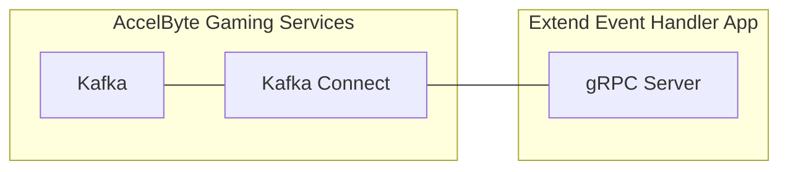
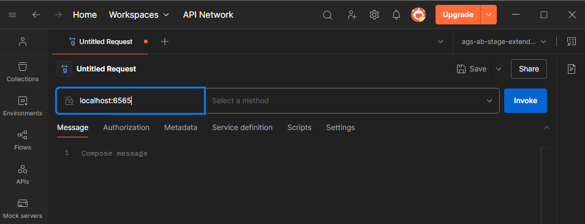
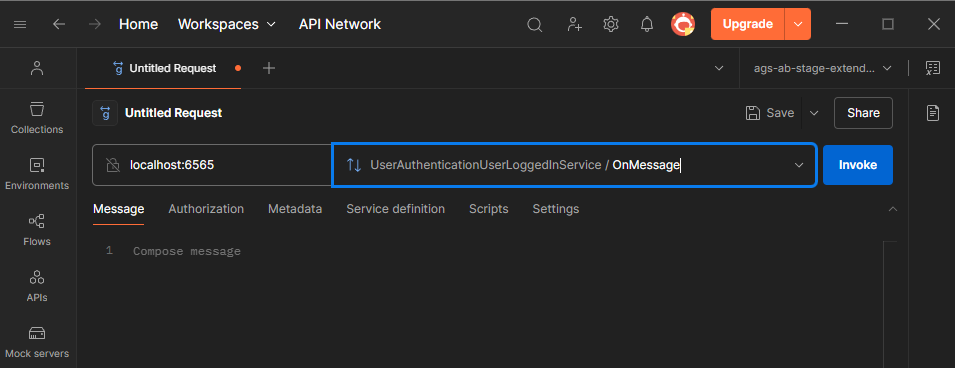
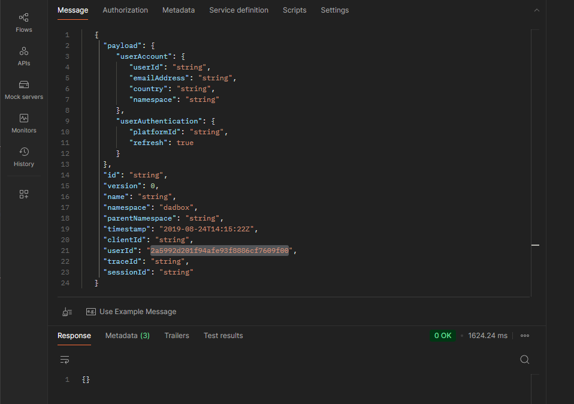

# extend-event-handler-csharp



`AccelByte Gaming Services` (AGS) capabilities can be enhanced using 
`Extend Event Handler` apps. An `Extend Event Handler` app is a `gRPC server` 
that receives AGS events through `Kafka Connect` and performs actions based on 
custom logic.

## Overview

This repository provides a project template for an `Extend Event Handler` 
app written in `C#`. It includes an example to handle AGS `userLoggedIn` event 
and grant an item to the user. Additionally, it comes with built-in 
instrumentation for observability, ensuring that metrics, traces, and logs are 
available upon deployment.

You can clone this repository to begin developing your own `Extend Event Handler`
app. Simply modify this project by including the AGS event spec files
you need and implement custom logic to handle those events.

## Project Structure

Here are some important folders you need to know to be able to start modifying
this project.

```text
...
├── src
│  ├── AccelByte.PluginArch.EventHandler.Demo.Server
│  │  ├── Protos                       # AGS event spec files (*.proto)
│  │  └── Services
│  │    └── UserLoggedInService.cs    # Logic to handle AGS event is implemented here
...
...
```

> :exclamation: In the example included in this project, we focus solely on the
`userLoggedIn` event. Therefore, only the AGS event spec files 
for IAM are included. For other events, the AGS event spec files are available
[here](https://github.com/AccelByte/accelbyte-api-proto/tree/main/asyncapi/accelbyte). 

## Prerequisites

1. Windows 11 WSL2 or Linux Ubuntu 22.04 or macOS 14+ with the following tools installed:

   a. Bash

      - On Windows WSL2 or Linux Ubuntu:

         ```
         bash --version

         GNU bash, version 5.1.16(1)-release (x86_64-pc-linux-gnu)
         ...
         ```

      - On macOS:

         ```
         bash --version

         GNU bash, version 3.2.57(1)-release (arm64-apple-darwin23)
         ...
         ```

   b. Make

      - On Windows WSL2 or Linux Ubuntu:

         To install from the Ubuntu repository, run `sudo apt update && sudo apt install make`.

         ```
         make --version

         GNU Make 4.3
         ...
         ```

      - On macOS:

         ```
         make --version

         GNU Make 3.81
         ...
         ```

   c. Docker (Docker Desktop 4.30+/Docker Engine v23.0+)
   
      - On Linux Ubuntu:

         1. To install from the Ubuntu repository, run `sudo apt update && sudo apt install docker.io docker-buildx docker-compose-v2`.
         2. Add your user to the `docker` group: `sudo usermod -aG docker $USER`.
         3. Log out and log back in to allow the changes to take effect.

      - On Windows or macOS:

         Follow Docker's documentation on installing the Docker Desktop on [Windows](https://docs.docker.com/desktop/install/windows-install/) or [macOS](https://docs.docker.com/desktop/install/mac-install/).

         ```
         docker version

         ...
         Server: Docker Desktop
            Engine:
            Version:          24.0.5
         ...
         ```

   d. .NET 8 SDK

      - On Linux Ubuntu:

         To install from the Ubuntu repository, run `sudo apt-get update && sudo apt-get install -y dotnet-sdk-8.0`.

      - On Windows or macOS:

         Follow Microsoft's documentation for installing .NET on [Windows](https://learn.microsoft.com/en-us/dotnet/core/install/windows) or on [macOS](https://learn.microsoft.com/en-us/dotnet/core/install/macos).


         ```
         dotnet --version
         
         8.0.119
         ```
      
   e. [Postman](https://www.postman.com/)

      - Use binary available [here](https://www.postman.com/downloads/)

   f. [extend-helper-cli](https://github.com/AccelByte/extend-helper-cli)

      - Use binary available [here](https://github.com/AccelByte/extend-helper-cli/releases)

   > :exclamation: In macOS, you may use [Homebrew](https://brew.sh/) to easily install some of the tools above.

2. Access to AGS environment.

   a. Base URL:

      - Sample URL for AGS Shared Cloud customers: `https://spaceshooter.prod.gamingservices.accelbyte.io`
      - Sample URL for AGS Private Cloud customers:  `https://dev.accelbyte.io`

   b. [Create a Game Namespace](https://docs.accelbyte.io/gaming-services/services/access/reference/namespaces/manage-your-namespaces/) if you don't have one yet. Keep the `Namespace ID`.


   c. [Create an OAuth Client](https://docs.accelbyte.io/gaming-services/services/access/authorization/manage-access-control-for-applications/#create-an-iam-client) with confidential client type with the following permissions. Keep the `Client ID` and `Client Secret`.
         
   - For AGS Private Cloud customers:
      - `ADMIN:NAMESPACE:{namespace}:USER:*:FULFILLMENT [CREATE]`
   - For AGS Shared Cloud customers:
      - Platform Store -> Fulfillment  (Create)

3. A published AGS Store. Take a note of the `item id` which is to be granted 
   after a user in a certain namespace successfully logged in.

## Setup

To be able to run this app, you will need to follow these setup steps.

1. Create a docker compose `.env` file by copying the content of 
   [.env.template](.env.template) file.

   > :warning: **The host OS environment variables have higher precedence 
   compared to `.env` file variables**: If the variables in `.env` file do not 
   seem to take effect properly, check if there are host OS environment 
   variables with the same name.  See documentation about 
   [docker compose environment variables precedence](https://docs.docker.com/compose/how-tos/environment-variables/envvars-precedence/) 
   for more details.

2. Fill in the required environment variables in `.env` file as shown below.

   ```
   AB_BASE_URL=https://demo.accelbyte.io     # Base URL of AccelByte Gaming Services demo environment
   AB_CLIENT_ID='xxxxxxxxxx'                 # Client ID from the Prerequisites section
   AB_CLIENT_SECRET='xxxxxxxxxx'             # Client Secret from the Prerequisites section
   AB_NAMESPACE='xxxxxxxxxx'                 # Namespace ID from the Prerequisites section
   ITEM_ID_TO_GRANT='xxxxxxxxxx'             # Item id from a published store we noted previously
   ```

## Building

To build this app, use the following command.

```shell
make build
```

The build output will be available in `.output` directory.

## Running

To (build and) run this app in a container, use the following command.

```shell
docker compose up --build
```

## Testing

### Test in Local Development Environment

This app can be tested locally using [Postman](https://www.postman.com/).

1. Run this app by using the command below.

   ```shell
   docker compose up --build
   ```

2. Open `Postman`, create a new `gRPC request`, and enter `localhost:6565` as the URL.

   

   > :warning: **If you are running [grpc-plugin-dependencies](https://github.com/AccelByte/grpc-plugin-dependencies) stack alongside this project as mentioned in [Test Observability](#test-observability)**: Use `localhost:10000` instead of `localhost:6565`. This way, the `gRPC server` will be called via `Envoy` service within `grpc-plugin-dependencies` stack instead of directly.

3. Since we are interested in `userLoggedIn` event, select `UserAuthenticationUserLoggedInService/OnMessage` method. 

   

4. Send a `userLoggedIn` event to the gRPC server by copying and pasting the sample Kafka event JSON below, then click `Invoke`. For the sample provided in this Extend app template, ensure that you provide valid values for at least `namespace` and `userId`.

   ```json
   {
     "payload": {
        "user_account": {
           "user_id": "string",
           "email_address": "string",
           "country": "string",
           "namespace": "string"
        },
        "user_authentication": {
           "platform_id": "string",
           "refresh": true
        }
     },
     "id": "string",
     "version": 0,
     "name": "string",
     "namespace": "string",
     "parent_namespace": "string",
     "timestamp": "2019-08-24T14:15:22Z",
     "client_id": "string",
     "user_id": "string",
     "trace_id": "string",
     "session_id": "string"
   }
   ```

   > :exclamation: **For other AGS events:** You can find the information and the corresponding sample Kafka event JSON
   [here](https://docs.accelbyte.io/gaming-services/knowledge-base/api-events/achievement/).
 
5. If successful, the response will appear as shown below, and you will also be able to see the item granted to the user you are using for this test.

   

   

### Test Observability

To be able to see the how the observability works in this app locally, there are few things that need be setup before performing tests.

1. Uncomment loki logging driver in [docker-compose.yaml](docker-compose.yaml)

   ```
    # logging:
    #   driver: loki
    #   options:
    #     loki-url: http://host.docker.internal:3100/loki/api/v1/push
    #     mode: non-blocking
    #     max-buffer-size: 4m
    #     loki-retries: "3"
   ```

   > :warning: **Make sure to install docker loki plugin beforehand**: Otherwise,
   this project will not be able to run. This is required so that container logs
   can flow to the `loki` service within `grpc-plugin-dependencies` stack. 
   Use this command to install docker loki plugin: `docker plugin install grafana/loki-docker-driver:latest --alias loki --grant-all-permissions`.

2. Clone and run [grpc-plugin-dependencies](https://github.com/AccelByte/grpc-plugin-dependencies) stack alongside this project. After this, Grafana 
will be accessible at http://localhost:3000.

   ```
   git clone https://github.com/AccelByte/grpc-plugin-dependencies.git
   cd grpc-plugin-dependencies
   docker compose up
   ```

   > :exclamation: More information about [grpc-plugin-dependencies](https://github.com/AccelByte/grpc-plugin-dependencies) is available [here](https://github.com/AccelByte/grpc-plugin-dependencies/blob/main/README.md).

3. Perform testing. For example, by following [Test in Local Development Environment](#test-in-local-development-environment).

## Deploying

After completing testing, the next step is to deploy your app to `AccelByte Gaming Services`.

1. **Create an Extend Event Handler app**

   If you do not already have one, create a new [Extend Event Handler App](https://docs.accelbyte.io/gaming-services/services/extend/event-handler/getting-started-event-handler/#create-the-extend-app).

   On the **App Detail** page, take note of the following values.
   - `Namespace`
   - `App Name`

   Under the **Environment Configuration** section, set the required secrets and/or variables.
   - Secrets
      - `AB_CLIENT_ID`
      - `AB_CLIENT_SECRET`
   - Variables
      - `ITEM_ID_TO_GRANT`

2. **Build and Push the Container Image**

   Use [extend-helper-cli](https://github.com/AccelByte/extend-helper-cli) to build and upload the container image.

   ```
   extend-helper-cli image-upload --login --namespace <namespace> --app <app-name> --image-tag v0.0.1
   ```

   > :warning: Run this command from your project directory. If you are in a different directory, add the `--work-dir <project-dir>` option to specify the correct path.

3. **Deploy the Image**
   
   On the **App Detail** page:
   - Click **Image Version History**
   - Select the image you just pushed
   - Click **Deploy Image**

## Next Step

Proceed by modifying this `Extend Event Handler` app template to implement your own custom logic. For more details, see [here](https://docs.accelbyte.io/gaming-services/services/extend/event-handler/how-to-listen-and-handle-different-ags-events/).
