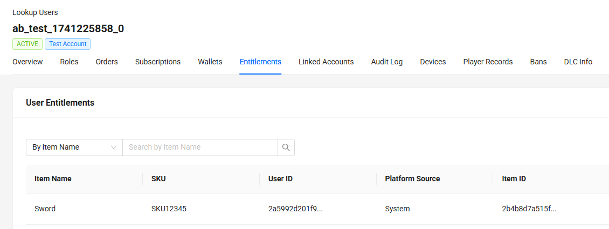

# extend-event-handler-csharp


`AccelByte Gaming Services` (AGS) capabilities can be extended with 
`Extend Event Handler` apps. An `Extend Event Handler` app is a gRPC server 
which listens to Kafka events from AGS via Kafka Connect and takes actions
according to a custom logic.

## Overview

This repository serves as a template project for an `Extend Event Handler` 
app written in `C#`. You can clone this repository and start creating custom 
event handler by including the relevant AGS event specification and 
implementing your own logic to handle AGS Kafka events.

By using this repository as a template project, you will get some 
instrumentation for observability out-of-the-box so that metrics, traces, and 
logs will be available when the app is deployed. Since the source code is 
included, you can customize them according to your needs.

As an example to get you started, this template project contains a sample
event handler which will listen to `userLoggedIn` event from AGS and then 
proceed to grant an entitlement 
to the said user. 

## Project Structure

```text
...
├── src
│  ├── AccelByte.PluginArch.EventHandler.Demo.Server
│  │  ├── AccelByte.PluginArch.EventHandler.Demo.Server.csproj
│  │  ├── Classes
│  │  │  ├── AppSettingConfigRepository.cs
│  │  │  ├── DebugLoggerServerInterceptor.cs
│  │  │  ├── DefaultAccelByteServiceProvider.cs
│  │  │  ├── ExceptionHandlingInterceptor.cs
│  │  │  └── IAccelByteServiceProvider.cs
│  │  ├── Metric
│  │  │  └── RequestPercentileMetricsListener.cs
│  │  ...
│  │  └── Services
│  │    └── UserLoggedInService.cs                    # Where we put custom logic that will get called when the event 
│  │                                                  # we interested got invoked
│  ...
...
```

The AGS event specification can be obtained [here](https://github.com/AccelByte/accelbyte-api-proto/tree/main/asyncapi/accelbyte). 
For the sample event handler, we are only interested in `userLoggedIn` event. 
Therefore, we only include the AGS event specification for IAM.

## Prerequisites

1. Windows 10 WSL2 or Linux Ubuntu 20.04 with the following tools installed.

   a. bash

   b. make

   c. [docker v23.x](https://docs.docker.com/engine/install/ubuntu/)

   d. .net 6 sdk
      
   e. [grpcui](https://github.com/fullstorydev/grpcui)

2. Access to AGS demo environment.

   a. Base URL:

      - For `Starter` tier e.g.  https://spaceshooter.prod.gamingservices.accelbyte.io
      - For `Premium` tier e.g.  https://dev.accelbyte.io

   b. [Create a Game Namespace](https://docs.accelbyte.io/gaming-services/tutorials/how-to/create-a-game-namespace/) if you don't have one yet. Keep the `Namespace ID`.


   c. [Create an OAuth Client](https://docs.accelbyte.io/gaming-services/services/access/authorization/manage-access-control-for-applications/#create-an-iam-client) with confidential client type with the following permissions. Keep the `Client ID` and `Client Secret`.
         
   - For AGS Premium customers:
      - `ADMIN:NAMESPACE:{namespace}:USER:*:ENTITLEMENT [CREATE]`
   - For AGS Starter customers:
      - Platform Store -> Entitlement (Create)

3. A published AGS Store. Take a note of the `item id` which is to be granted 
   after a user in a certain namespace successfully logged in.

## Setup

To be able to run the sample event handler, you will need to follow these setup 
steps.

1. Create a docker compose `.env` file by copying the content of 
   [.env.template](.env.template) file.

   > :warning: **The host OS environment variables have higher precedence 
   compared to `.env` file variables**: If the variables in `.env` file do not 
   seem to take effect properly, check if there are host OS environment 
   variables with the same name.  See documentation about 
   [docker compose environment variables precedence](https://docs.docker.com/compose/environment-variables/envvars-precedence/) 
   for more details.

2. Fill in the required environment variables in `.env` file as shown below.

   ```
   AB_BASE_URL=https://demo.accelbyte.io     # Base URL of AccelByte Gaming Services demo environment
   AB_CLIENT_ID='xxxxxxxxxx'                 # Client ID from the Prerequisites section
   AB_CLIENT_SECRET='xxxxxxxxxx'             # Client Secret from the Prerequisites section
   AB_NAMESPACE='xxxxxxxxxx'                 # Namespace ID from the Prerequisites section
   ITEM_ID_TO_GRANT='xxxxxxxxxx'             # Item id from a published store we noted previously
   ```

   For more options, create `src/AccelByte.PluginArch.EventHandler.Demo.Server/appsettings.Development.json` and fill in the required configuration.

   ```json
   {
      "RevocationListRefreshPeriod": 60,
      "AccelByte": {
         "BaseUrl": "https://demo.accelbyte.io",     // Base URL (env var: AB_BASE_URL)
         "ClientId": "xxxxxxxxxx",                   // Client ID (env var: AB_CLIENT_ID)    
         "ClientSecret": "xxxxxxxxxx",               // Client Secret (env var: AB_CLIENT_SECRET)
         "AppName": "EVENTHANDLERDEMOGRPCSERVICE",
         "TraceIdVersion": "1",
         "Namespace": "xxxxxxxxxx",                  // Namespace ID (env var: AB_NAMESPACE)
         "EnableTraceId": true,
         "EnableUserAgentInfo": true,
         "ResourceName": "EVENTHANDLERDEMOGRPCSERVICE",
         "ItemIdToGrant": "xxxxxxxxxxxx"             // ItemId to grant (env var: ITEM_ID_TO_GRANT)
      }
   }
   ```
   > :warning: **Environment variable values will override related configuration values in this file**.


## Building

To build this sample app, use the following command.

```shell
$ make build
```

The build output will be available in `.output` directory.

## Running

To (build and) run this sample app in a container, use the following command.

```shell
$ docker compose up --build
```

## Testing

### Unit Test

Unit test is provided in `src/AccelByte.PluginArch.EventHandler.Demo.Tests`. 
To run the test, you'll need to fill the env var file mentioned below.

```
AB_BASE_URL=https://demo.accelbyte.io     # Base URL of AccelByte Gaming Services demo environment
AB_CLIENT_ID='xxxxxxxxxx'                 # OAuth Client ID
AB_CLIENT_SECRET='xxxxxxxxxx'             # OAuth  Client Secret
AB_NAMESPACE='xxxxxxxxxx'                 # Namespace ID
```

You also need to add following permissions to your OAuth Client
   - For AGS Premium customers:
      - `ADMIN:NAMESPACE:{namespace}:USER [READ,CREATE,DELETE]`
      - `ADMIN:NAMESPACE:{namespace}:STORE [READ,CREATE,UPDATE,DELETE]`
      - `ADMIN:NAMESPACE:{namespace}:CATEGORY [CREATE]`
      - `ADMIN:NAMESPACE:{namespace}:CURRENCY [READ,CREATE,DELETE]`
      - `ADMIN:NAMESPACE:{namespace}:ITEM [READ,CREATE,DELETE]`
      - `NAMESPACE:{namespace}:USER:{userId}:STORE [READ]`
   - For AGS Starter customers:
      - IAM -> Users (Read, Create, Delete)
      - Platform Store -> Store (Read, Create, Update, Delete)
      - Platform Store -> Category (Create)
      - Platform Store -> Currency (Read, Create, Delete)
      - Platform Store -> Item (Read, Create, Delete)


Finally, execute the command below to run the test.

```shell
$ make test
```

> :warning: **Unit test WILL modify your current stores configuration:** Please 
proceed with caution. We recommend to create a dedicated namespace for this.

### Test in Local Development Environment

The sample event handler can be tested locally using [grpcui](https://github.com/fullstorydev/grpcui).

1. Run this `Extend Event Handler` sample app by using the command below.

   ```shell
   docker compose up --build
   ```

2. Run `grpcui` with the following command.

   ```shell
   grpcui -plaintext localhost:6565
   ```

   > :warning: **If you are running 
   [grpc-plugin-dependencies](https://github.com/AccelByte/grpc-plugin-dependencies) 
   stack alongside this sample app as mentioned in 
   [Test Observability](#test-observability)**: Use `localhost:10000` instead of `localhost:6565`. This way, the `gRPC server` will be called via `Envoy` 
   service within `grpc-plugin-dependencies` stack instead of directly.

3. Now in `grpcui`, send a sample of kafka event you are interested in. In this 
   case, we are interested in `userLoggedIn` event. So, we are using sample payload 
   [here](https://docs.accelbyte.io/gaming-services/developers/api-events/iam-account/#message-userloggedin).


   ```json
   {
     "payload": {
        "userAccount": {
           "userId": "string",
           "emailAddress": "string",
           "country": "string",
           "namespace": "string"
        },
        "userAuthentication": {
           "platformId": "string",
           "refresh": true
        }
     },
     "id": "string",
     "version": 0,
     "name": "string",
     "namespace": "string",
     "parentNamespace": "string",
     "timestamp": "2019-08-24T14:15:22Z",
     "clientId": "string",
     "userId": "string",
     "traceId": "string",
     "sessionId": "string"
   }
   ```

   > :exclamation: You can change the field value you are interested in to suits 
   your need, e.g. `namespace` , `userId`, etc

   Finally, make sure to select the right service name and method name
   and click `Invoke` to send the request.

   


   > :exclamation: **If you are interested on other events:** you can find it 
   [here](https://docs.accelbyte.io/gaming-services/developers/api-events/achievement/).

 
4. If successful, you will see in the response as follows and you can also see 
   the item granted to the user you are using for this test.
   
    

   

### Test Observability

To be able to see the how the observability works in this sample app locally, 
there are few things that need be setup before performing tests.

1. Uncomment loki logging driver in [docker-compose.yaml](docker-compose.yaml)

   ```
    # logging:
    #   driver: loki
    #   options:
    #     loki-url: http://host.docker.internal:3100/loki/api/v1/push
    #     mode: non-blocking
    #     max-buffer-size: 4m
    #     loki-retries: "3"
   ```

   > :warning: **Make sure to install docker loki plugin beforehand**: Otherwise,
   this sample app will not be able to run. This is required so that container logs
   can flow to the `loki` service within `grpc-plugin-dependencies` stack. 
   Use this command to install docker loki plugin: `docker plugin install grafana/loki-docker-driver:latest --alias loki --grant-all-permissions`.

2. Clone and run [grpc-plugin-dependencies](https://github.com/AccelByte/grpc-plugin-dependencies) stack alongside this sample app. After this, Grafana 
will be accessible at http://localhost:3000.

   ```
   git clone https://github.com/AccelByte/grpc-plugin-dependencies.git
   cd grpc-plugin-dependencies
   docker compose up
   ```

   > :exclamation: More information about [grpc-plugin-dependencies](https://github.com/AccelByte/grpc-plugin-dependencies) is available [here](https://github.com/AccelByte/grpc-plugin-dependencies/blob/main/README.md).

3. Perform testing. For example, by following [Test in Local Development Environment](#test-in-local-development-environment).

## Deploying

To deploy this app to AGS, follow the steps below.

1. [Create a new Extend Event Handler app on Admin Portal](https://docs.accelbyte.io/gaming-services/services/extend/events-handler/). Keep the `Repository URI`.

2. Download and setup [extend-helper-cli](https://github.com/AccelByte/extend-helper-cli/)   (only if it has not been done previously).

3. Perform docker login with `extend-helper-cli` using the following command.
   ```
   extend-helper-cli dockerlogin --namespace <my-game> --app <my-app> --login
   ```
   > :exclamation: For your convenience, the above `extend-helper-cli` command 
   can also be copied from `Repository Authentication Command` under the 
   corresponding app detail page.

4. Build and push sample app docker image to AccelByte ECR using the following command.
   ```
   make imagex_push IMAGE_TAG=v0.0.1 REPO_URL=xxxxxxxxxx.dkr.ecr.us-west-2.amazonaws.com/accelbyte/justice/development/extend/xxxxxxxxxx/xxxxxxxxxx
   ```
   > :exclamation: **The REPO_URL is obtained from step 1**: It can be found 
   under 'Repository URI' in the app detail.

5. Open Admin Portal, go to **Extend** -> **Event Handler**. And then select 
   the extend app.

6. To deploy selected image tag, click **Image Version History** and select 
   desired image tag to be deployed.

7. Click **Deploy Image**, confirm the deployment and go back to App Detail by 
   clicking **Cancel**.

8. Wait until app status is running.

For more information on how to deploy an `Extend Event Handler` app, see 
[here](https://docs.accelbyte.io/gaming-services/services/extend/events-handler/getting-started-event-handler/#build-and-upload-the-extend-app).

## Next Step

Proceed to modify this template project and create your custom event handler. 
See [here](https://docs.accelbyte.io/gaming-services/services/extend/events-handler/working-with-protobuf-event-descriptor/) for more details.
